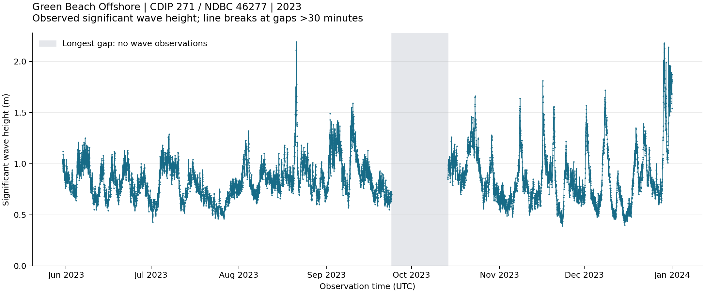

# San Onofre Surf Condition Forecasting

I'm building this project to forecast significant wave height near San Onofre
six hours ahead using historical wave observations and, where useful, weather
and tide data. I want to test whether machine learning can improve on a simple
baseline: predicting that wave height will stay the same over the next six hours.

## Current progress

I started by inspecting the 2023 observations from Green Beach Offshore
(CDIP 271 / NDBC 46277). The dataset contains 9,525 rows, missing wave measurements,
and irregular timestamps, including a gap of more than 19 days.

Further inspection shows that all four wave fields are missing together on
175 rows. Records with wave measurements use both 00/30 and 26/56 minutes
within the hour; some short intervals separate wave records from records
containing temperature but no wave measurements.

I separated the 9,350 records with all four wave fields into a wave observation
table. Its intervals are at least 30 minutes, with 21 longer gaps. The largest
gap between wave observations is 19 days, 21 hours, and 26 minutes. Original
timestamps are preserved, and missing measurements remain unfilled.

All 9,350 retained observations pass basic checks for nonnegative wave height,
positive wave periods, and directions within 0-360 degrees. These checks address
obvious value violations; they do not establish full measurement accuracy.

These observations describe offshore conditions rather than breaking-wave height
at San Onofre. Selecting the nearshore target location and investigating data
quality are the next steps. Model development has not started yet.

## Wave height over time



The plot shows all 9,350 retained wave-height observations at their original
timestamps. Lines break whenever successive observations are more than 30 minutes
apart. The shaded interval marks the longest gap; smaller gaps also break the
line but are difficult to distinguish at this scale.

Several rises and falls are visible, including peaks above 2 meters in August
and late December. The plot alone does not establish the causes of these events
or a recurring seasonal pattern.

## Files

- `inspect_waves.py`: inspect the observations and generate the wave-height plot.
- `figures/wave_height_2023.png`: generated plot of the 2023 wave observations.
- `data/README.md`: data source, units, download command, and limitations.
- `requirements.txt`: Python dependencies.
- `.gitignore`: keep the local environment and downloaded data out of Git.

## Setup

From the project directory in PowerShell:

```powershell
python -m venv .venv
.\.venv\Scripts\python.exe -m pip install -r requirements.txt
```

Download the dataset using the commands in [data/README.md](data/README.md), then
run the inspection:

```powershell
.\.venv\Scripts\python.exe inspect_waves.py
```

Running the script also saves `figures/wave_height_2023.png`; it does not open
an interactive plot window. Verified with Python 3.10.6, pandas 2.3.3, and
Matplotlib 3.10.8.

## Planned evaluation

I plan to compare models against a persistence baseline using chronological
training and validation periods. Features must use information available at the
time of prediction, and a separate final test period will remain untouched during
feature selection and model tuning.

The 2023 data has already been used for exploratory analysis and will not serve
as an untouched final test set. Split dates will be chosen after confirming the
target dataset and its usable coverage.
